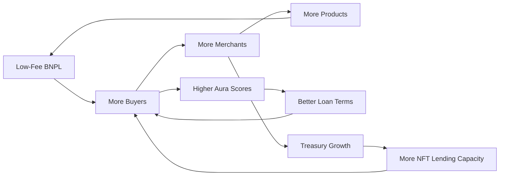

<div align="center">

# ◆ NexaPay Protocol

### _Non-Custodial BNPL on BNB Chain_

**Buy now. Pay in 4. Trustlessly.**

[](https://soliditylang.org/)
[](https://testnet.bscscan.com/)
[](https://react.dev/)
[](https://www.typescriptlang.org/)
[](https://docs.docker.com/compose/)
[](./LICENSE)

[Live Demo](https://nexapay31.netlify.app/) · [Contracts on BSCScan](./bsc.addresses) · [Docs](./docs/)

</div>

---

## ✦ What is NexaPay?

> **The first non-custodial Buy Now Pay Later protocol on BNB Chain.**

NexaPay lets users split on-chain purchases into **4 weekly installments** while merchants receive **instant payment**. Collateral is locked at 150% in a decentralized vault — no intermediaries, no credit checks, no banks.

Users can also **borrow BNB against their NFTs** (50% LTV, 5% interest, 30-day terms) and build an **on-chain credit reputation** through the Aura Score system.

---

## ✦ Value Proposition

| For Buyers | For Merchants | For the Ecosystem |
|:---|:---|:---|
| Split payments into 4 weeks | Get paid instantly at purchase | Non-custodial — funds never sit in a multisig |
| No credit checks, no KYC | Zero chargeback risk | On-chain transparency for every transaction |
| Earn "Aura" credit score | On-chain sales dashboard | Composable DeFi primitive on BNB Chain |
| Borrow BNB against NFTs | Automatic installment tracking | Dockerized for reproducible demos |

---

## ✦ Target Users

| Persona | Description |
|:---|:---|
| **🛒 Crypto-Native Shoppers** | DeFi users who want structured spending without selling assets |
| **🏪 Web3 Merchants** | Stores/DAOs that want instant settlement with zero fraud risk |
| **🎨 NFT Holders** | Collectors who want liquidity without parting with their JPEGs |
| **🏗️ DeFi Builders** | Developers looking for composable BNPL primitives to integrate |

---

## ✦ User Journey

```mermaid
journey
    title NexaPay — Buyer Experience
    section Connect
      Visit NexaPay dApp: 5: Buyer
      Connect MetaMask wallet: 5: Buyer
    section Shop
      Browse product catalog: 4: Buyer
      Select product to purchase: 4: Buyer
    section Purchase (BNPL)
      Lock 1.5x collateral in vault: 3: Buyer, Vault
      Merchant receives full payment instantly: 5: Merchant
      Loan created with 4 weekly installments: 4: Smart Contract
    section Repay
      Pay installment 1 of 4: 4: Buyer
      Pay installment 2 of 4: 4: Buyer
      Pay installment 3 of 4: 4: Buyer
      Pay final installment: 5: Buyer
      Collateral released back to buyer: 5: Vault
    section Aura Score
      Score updated based on behavior: 5: Aura Engine
```



---

## ✦ System Architecture

```mermaid
graph TB
    subgraph Frontend ["🌐 Frontend (Vite + React 19 + TS)"]
        UI[Pages: Landing / Shop / Dashboard / Merchant / NFT Loans / Aura]
        Hooks[Hooks: useNexaPay / useNFTLoan / useAura]
        Web3Ctx[Web3Context — ethers.js v6]
        Theme[ThemeContext — Dark/Light Mode]
    end

    subgraph Contracts ["⛓️ Smart Contracts (Solidity 0.8.24)"]
        BNPLLoan[BNPLLoan.sol<br/>Loans · Products · Merchants · Installments]
        Vault[CollateralVault.sol<br/>Lock · Release · Liquidate · 150%]
        NFTLoan[NFTCollateralLoan.sol<br/>NFT Collateral · 50% LTV · 5% Interest]
        MockNFT[MockNFT.sol<br/>ERC-721 for Testing]
    end

    subgraph Infra ["🐳 Infrastructure"]
        Docker[Docker Compose<br/>Hardhat Node + Nginx Frontend]
        BSC[BSC Testnet<br/>Chain ID 97]
        Netlify[Netlify — Static Deploy]
    end

    UI --> Hooks --> Web3Ctx
    Web3Ctx -->|ethers.js v6| BNPLLoan
    Web3Ctx -->|ethers.js v6| Vault
    Web3Ctx -->|ethers.js v6| NFTLoan
    BNPLLoan --> Vault
    NFTLoan --> MockNFT
    Docker --> Contracts
    BSC --> Contracts
    UI --> Theme
```



---

## ✦ Smart Contracts

| Contract | Address (BSC Testnet) | Purpose |
|:---|:---|:---|
| **CollateralVault** | [`0x76Bd...878c`](https://testnet.bscscan.com/address/0x76Bd629f22ee03762490559BF528033206AD878c) | Locks BNB at 150% ratio. Handles release & liquidation. |
| **BNPLLoan** | [`0xF0f5...cAf0`](https://testnet.bscscan.com/address/0xF0f5B50fc5f892E3cEd6C16A228a4104FA9bcAf0) | Loan lifecycle, products, merchants, 4-installment repayment. |
| **NFTCollateralLoan** | [`0x34fc...1C5b`](https://testnet.bscscan.com/address/0x34fc01159cad4f5BA5f0CdE23E41D21011581C5b) | NFT-backed loans: 50% LTV, 5% interest, 30-day terms. |
| **MockNFT (NPNFT)** | [`0x3808...59E2`](https://testnet.bscscan.com/address/0x3808Ecd5Dfb2E74C96B75D7E1994e783e5c359E2) | ERC-721 for demo/testing. Free mint. |

> Full addresses → [`bsc.addresses`](./bsc.addresses)

### Key Parameters

| Parameter | Value |
|:---|:---|
| Collateral Ratio | **150%** (1.5× product price) |
| Installments | **4 weekly payments** |
| Grace Period | **3 days** after due date |
| NFT Loan LTV | **50%** of deposited BNB |
| NFT Interest | **5%** flat |
| NFT Loan Duration | **30 days** |

---

## ✦ Aura — On-Chain Credit Score

Every wallet builds a **reputation score (0–1000)** from 6 weighted factors:

| Factor | Weight | What It Measures |
|:---|:---|:---|
| Repayment Reliability | 40% | On-time payments vs. defaults |
| Payment Discipline | 25% | Early/on-time vs. late payments |
| Borrowing Experience | 15% | Total loan history depth |
| Portfolio Diversity | 8% | Mix of BNPL + NFT loans |
| Collateral Behavior | 6% | Proper collateral claims |
| NFT Lending Record | 6% | NFT loan repayment history |

| Tier | Score Range | Meaning |
|:---|:---|:---|
| 🌟 Legendary | 850–1000 | Gold standard of DeFi trust |
| 💜 Strong | 700–849 | Excellent track record |
| 📈 Rising | 550–699 | Building solid reputation |
| ⚪ Neutral | 400–549 | Average — room to grow |
| 🔺 Weak | 200–399 | Concerning patterns |
| ⚡ Broken | 0–199 | Major trust issues |

> Aura is **100% frontend-computed** from on-chain data. No oracle, no centralized server.

---

## ✦ Business Model

NexaPay captures value at **every stage of the lending lifecycle** without relying on a governance token.

### Revenue Streams

| Stream | Mechanism | When |
|:---|:---|:---|
| **BNPL Protocol Fee** | 1–2% service fee on each installment purchase | Every purchase |
| **NFT Lending Interest** | 5% flat interest on NFT-backed BNB loans | Every NFT loan |
| **Liquidation Surplus** | Collateral exceeding outstanding debt is retained by the treasury on defaults | On default events |
| **Treasury Yield** | Protocol treasury funds deployed to BNB Chain yield strategies (Venus, Alpaca) during idle periods | Continuous |
| **Aura-Tiered Pricing** | High Aura wallets (700+) unlock reduced collateral ratios (down to 120%), driving repeat usage | Repeat borrowers |
| **Merchant Integration API** | Paid API access for Web3 merchants and dApps to embed NexaPay checkout | B2B partnerships |
| **Cross-Chain Bridge Fees** | Toll on cross-chain BNPL transactions via LayerZero/Wormhole (Phase 3) | Future expansion |

### Unit Economics

```
Per 1 BNB BNPL Purchase:
  Protocol fee (1.5%)          = 0.015 BNB
  Treasury holds 1.5 BNB collateral during loan term
  If default → surplus captured (up to 0.5 BNB after debt coverage)

Per 1 BNB NFT Loan:
  Interest income (5%)         = 0.05 BNB
  If default → NFT liquidation value captured
```

### Growth Flywheel



> No governance token at this stage. Revenue is **protocol-native** — earned through service fees, interest, and treasury management, not token inflation.

---

## ✦ Go-To-Market Strategy

```
Phase 1 — Hackathon MVP (NOW)
├── Core BNPL + NFT lending on BSC Testnet
├── Aura credit scoring engine
└── Full Docker + Netlify deployment

Phase 2 — Community Launch
├── Mainnet deployment on BNB Chain
├── Merchant onboarding SDK
├── Aura score API for third-party integrations
└── BNB Greenfield integration for product metadata

Phase 3 — Ecosystem Growth
├── opBNB integration for gasless microtransactions
├── Cross-chain BNPL via LayerZero/Wormhole
├── BEP-20 collateral support (beyond native BNB)
└── Institutional merchant partnerships
```

---

## ✦ Roadmap

| Quarter | Milestone |
|:---|:---|
| **Q1 2026** | ✅ Hackathon MVP — BNPL + NFT Loans + Aura Score |
| **Q2 2026** | Mainnet launch, merchant SDK, security audit |
| **Q3 2026** | Aura API, opBNB gasless mode, BEP-20 collateral |
| **Q4 2026** | Cross-chain BNPL, institutional onboarding |
| **2027** | Mobile wallet app, fiat on-ramp, credit delegation |

---

## ✦ Quick Start

### Prerequisites

- Node.js ≥ 18 · Git · MetaMask

### Option A: Docker (Recommended)

```bash
git clone https://github.com/mdsaad31/BNPL-project.git
cd BNPL-project
docker compose up --build
```

| Service | URL |
|:---|:---|
| Frontend | `http://localhost:3000` |
| Hardhat RPC | `http://localhost:8545` |

### Option B: Manual Setup

```bash
# 1. Clone & install
git clone https://github.com/mdsaad31/BNPL-project.git
cd BNPL-project

# 2. Contracts
cd contracts && npm install
npx hardhat node                    # Terminal 1
npx hardhat run scripts/deploy.js --network localhost  # Terminal 2

# 3. Frontend
cd ../frontend && npm install
npm run dev                         # → http://localhost:5173
```

### Option C: BSC Testnet (Live)

Contracts are already deployed. Just:

```bash
cd frontend && npm install && npm run dev
```

Connect MetaMask to **BSC Testnet** (Chain ID 97) and get test BNB from the [BNB Faucet](https://testnet.bnbchain.org/faucet-smart).

---

## ✦ Demo Flows

### 🛒 BNPL Purchase

1. Connect wallet → Browse `/shop` → Select product
2. Confirm purchase → 1.5× collateral locked in vault → Merchant paid instantly
3. Visit `/dashboard` → Pay 4 weekly installments → Collateral released

### 🎨 NFT Lending

1. Go to `/nft-loans` → Mint a demo NFT
2. Deposit BNB into NFT treasury → Borrow against your NFT (50% LTV)
3. Repay loan + 5% interest within 30 days → NFT returned

### ⚡ Default & Liquidation

1. Purchase a product → Use Dev Panel (bottom-right gear icon) to fast-forward time
2. Let grace period expire → Trigger default on dashboard
3. Collateral liquidated: outstanding debt to treasury, remainder refunded

### 🌟 Aura Score

1. Connect wallet → Visit `/aura`
2. View your real-time credit score computed from all on-chain activity
3. See factor breakdowns, tier badge, improvement tips

---

## ✦ Testing

```bash
cd contracts
npx hardhat test
```

**20 tests** covering:

- ✅ Collateral math (1.5× constraints)
- ✅ Merchant registration & product CRUD
- ✅ Purchase flow with collateral locking
- ✅ Installment payments
- ✅ Full repayment with collateral release
- ✅ Default/liquidation with correct fund distribution

---

## ✦ Tech Stack

| Layer | Technology |
|:---|:---|
| **Smart Contracts** | Solidity 0.8.24 · Hardhat 2.28.6 · OpenZeppelin v5.4.0 |
| **Frontend** | Vite 7 · React 19 · TypeScript 5.9 · ethers.js v6.16 |
| **Styling** | Inline React styles with theme tokens (dark/light) |
| **Icons** | 43+ custom SVG components — zero emoji, zero icon libraries |
| **Backend** | Convex (real-time data sync) |
| **Deployment** | Netlify (frontend) · BSC Testnet (contracts) |
| **DevOps** | Docker Compose (Hardhat node + Nginx) |
| **Testing** | Hardhat + Chai + hardhat-network-helpers |

---

## ✦ Open-Source Dependencies

NexaPay is built entirely on open-source software.

### Smart Contracts

| Package | Version | License | Purpose |
|:---|:---|:---|:---|
| [Hardhat](https://hardhat.org/) | 2.28.6 | MIT | Ethereum development environment — compile, test, deploy |
| [OpenZeppelin Contracts](https://www.openzeppelin.com/contracts) | 5.4.0 | MIT | Battle-tested ERC-721, ReentrancyGuard, Ownable |
| [Hardhat Toolbox](https://hardhat.org/hardhat-runner/plugins/nomicfoundation-hardhat-toolbox) | 5.0.0 | MIT | Ethers, Chai, coverage, gas reporter, verification |
| [dotenv](https://github.com/motdotla/dotenv) | 17.3.1 | BSD-2 | Environment variable management |

### Frontend

| Package | Version | License | Purpose |
|:---|:---|:---|:---|
| [React](https://react.dev/) | 19.2.0 | MIT | UI component library |
| [React DOM](https://react.dev/) | 19.2.0 | MIT | DOM rendering for React |
| [React Router DOM](https://reactrouter.com/) | 6.30.3 | MIT | Client-side routing (SPA) |
| [ethers.js](https://docs.ethers.org/) | 6.16.0 | MIT | Ethereum wallet & contract interactions |
| [Convex](https://www.convex.dev/) | 1.32.0 | Apache-2.0 | Real-time backend data sync |
| [Vite](https://vite.dev/) | 7.3.1 | MIT | Lightning-fast build tool & dev server |
| [TypeScript](https://www.typescriptlang.org/) | 5.9.3 | Apache-2.0 | Static type checking |
| [ESLint](https://eslint.org/) | 9.39.1 | MIT | Code quality & linting |

### Infrastructure

| Tool | Purpose |
|:---|:---|
| [Docker](https://www.docker.com/) | Containerized reproducible builds |
| [Nginx](https://nginx.org/) | Static file serving in production container |
| [Netlify](https://www.netlify.com/) | Continuous deployment from GitHub |
| [BNB Chain (BSC)](https://www.bnbchain.org/) | Layer-1 EVM blockchain for contract deployment |

---

## ✦ What Makes NexaPay Unique

| Feature | NexaPay | Traditional BNPL | Other DeFi |
|:---|:---|:---|:---|
| Non-custodial | ✅ Fully on-chain | ❌ Centralized | ⚠️ Varies |
| Instant merchant payout | ✅ At purchase | ❌ 2–30 day settlement | ❌ N/A |
| No credit check | ✅ Collateral-based | ❌ Credit score required | ✅ |
| NFT-backed loans | ✅ Built-in | ❌ | ⚠️ Separate protocol |
| On-chain credit score | ✅ Aura (6-factor) | ❌ Off-chain FICO | ❌ |
| Dockerized | ✅ One command | ❌ | ❌ Rare |
| Real BNB Chain | ✅ BSC Testnet | ❌ | ⚠️ |

---

## ✦ Security

| Measure | Implementation |
|:---|:---|
| Reentrancy Protection | OpenZeppelin `ReentrancyGuard` on all state-changing functions |
| Access Control | `Ownable` pattern; only loan contract can access vault |
| Collateral Safety | 150% over-collateralization enforced at contract level |
| No Hardcoded Secrets | `.env` for private keys, excluded via `.gitignore` |
| Grace Period | 3-day buffer before liquidation triggers |

---

## ✦ Project Structure

```
BNPL/
├── contracts/                    # Hardhat smart contracts
│   ├── src/
│   │   ├── BNPLLoan.sol          # Loan lifecycle & repayment (294 lines)
│   │   ├── CollateralVault.sol   # BNB collateral management (143 lines)
│   │   ├── NFTCollateralLoan.sol # NFT-backed lending (292 lines)
│   │   └── MockNFT.sol           # Demo ERC-721 (35 lines)
│   ├── test/
│   │   └── TrustPay.test.js      # 20 comprehensive tests (279 lines)
│   ├── scripts/
│   │   └── deploy.js             # Deploy + seed demo data
│   └── hardhat.config.js         # BSC Testnet + localhost config
│
├── frontend/                     # Vite + React + TypeScript
│   └── src/
│       ├── contracts/            # ABIs + deployment.json
│       ├── context/              # Web3Context, ThemeContext
│       ├── hooks/                # useNexaPay, useNFTLoan, useAura
│       ├── components/           # Navbar, Layout, Icons (43+ SVGs), DevPanel
│       └── pages/                # Landing, Shop, Dashboard, Merchant, NFTLoans, Aura
│
├── docs/
│   ├── PROJECT.md                # Problem · Solution · Impact · Roadmap
│   └── TECHNICAL.md              # Architecture · Setup · Demo guide
│
├── bsc.addresses                 # All deployed contract addresses
├── docker-compose.yml            # One-command Docker setup
├── Dockerfile                    # Multi-stage: Hardhat + Nginx
├── netlify.toml                  # Netlify deployment config
├── LICENSE                       # MIT License
└── README.md                     # ← You are here
```

---

## ✦ Documentation

| Document | Contents |
|:---|:---|
| [docs/PROJECT.md](./docs/PROJECT.md) | Problem → Solution → Impact → Roadmap |
| [docs/TECHNICAL.md](./docs/TECHNICAL.md) | Architecture → Setup → Demo walkthrough |
| [bsc.addresses](./bsc.addresses) | All BSC Testnet contract addresses |

---

## ✦ License

This project is licensed under the **MIT License** — see the [LICENSE](./LICENSE) file.

---

<div align="center">

**Built with mass amounts of caffeine, impeccable smart contracts, and a dream.**

◆ NexaPay Protocol · BNB Chain Hackathon 2026 ◆

</div>
