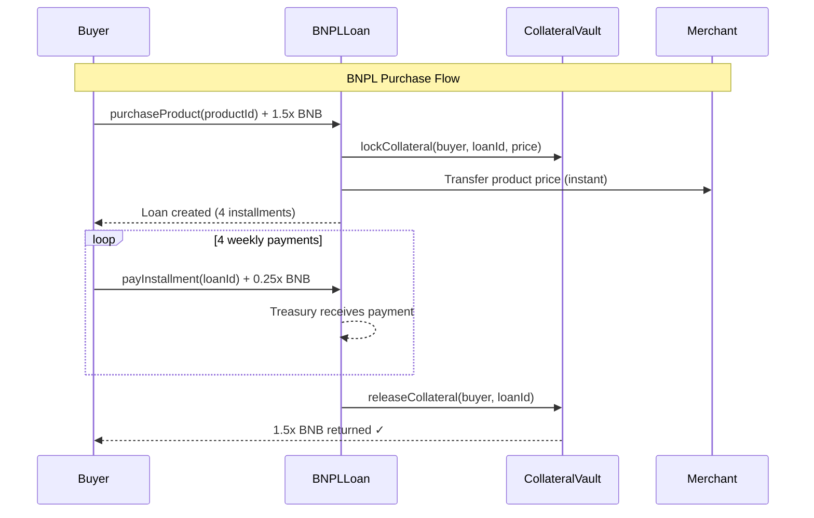
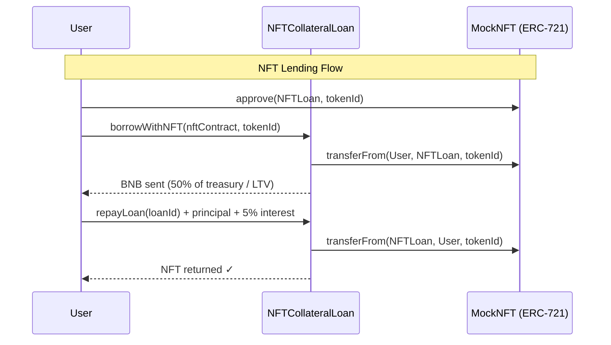

<div align="center">

# ◆ NexaPay — Technical Documentation

### Architecture · Setup · Demo

</div>

---

## ✦ Architecture Overview

NexaPay is a **three-layer stack**: smart contracts on BNB Chain, a React frontend, and Docker-based infrastructure.

```
┌──────────────────────────────────────────────────────────────┐
│                        FRONTEND LAYER                         │
│          Vite 7 · React 19 · TypeScript 5.9 · ethers v6      │
├──────────────────────────────────────────────────────────────┤
│                                                               │
│  Pages                          Hooks                         │
│  ├── Landing.tsx                ├── useNexaPay.ts (BNPL)      │
│  ├── Shop.tsx                   ├── useNFTLoan.ts (NFT)       │
│  ├── Dashboard.tsx              ├── useAura.ts (Credit Score)  │
│  ├── Merchant.tsx               └── useResponsive.ts           │
│  ├── NFTLoans.tsx                                              │
│  └── Aura.tsx                  Context                         │
│                                ├── Web3Context.tsx              │
│  Components                    └── ThemeContext.tsx              │
│  ├── Navbar.tsx                                                │
│  ├── Layout.tsx                Contracts                        │
│  ├── Icons.tsx (43+ SVGs)      ├── deployment.json              │
│  └── DevPanel.tsx              └── ABI JSON files               │
│                                                               │
└───────────────────────┬──────────────────────────────────────┘
                        │ ethers.js v6
                        ▼
┌──────────────────────────────────────────────────────────────┐
│                     SMART CONTRACT LAYER                      │
│             Solidity 0.8.24 · OpenZeppelin v5.4.0             │
├──────────────────────────────────────────────────────────────┤
│                                                               │
│  BNPLLoan.sol (294 lines)                                     │
│  ├── Loan struct: buyer, merchant, 4 installments, status     │
│  ├── purchaseProduct() → pays merchant from treasury          │
│  ├── payInstallment() → tracks payments, replenishes treasury │
│  ├── triggerDefault() → liquidates collateral                 │
│  ├── Product & Merchant management                            │
│  ├── treasuryBalance() / withdrawTreasury() / receive()       │
│  └── Depends on → CollateralVault                             │
│                                                               │
│  CollateralVault.sol (143 lines)                              │
│  ├── lockCollateral() → holds 150% of product price           │
│  ├── releaseCollateral() → returns BNB after full repayment   │
│  ├── liquidateCollateral() → splits funds on default          │
│  └── Only BNPLLoan contract can call lock/release/liquidate   │
│                                                               │
│  NFTCollateralLoan.sol (292 lines)                            │
│  ├── borrowWithNFT() → lock ERC-721, receive BNB (50% LTV)   │
│  ├── repayLoan() → pay back + 5% interest, get NFT back      │
│  ├── liquidateLoan() → default after 30 days, NFT retained    │
│  ├── ERC721Receiver implementation                            │
│  └── Independent treasury (separate from BNPL)                │
│                                                               │
│  MockNFT.sol (35 lines)                                       │
│  └── Simple ERC-721 for demo. mint() / mintTo()               │
│                                                               │
└───────────────────────┬──────────────────────────────────────┘
                        │ JSON-RPC
                        ▼
┌──────────────────────────────────────────────────────────────┐
│                    INFRASTRUCTURE LAYER                        │
├──────────────────────────────────────────────────────────────┤
│                                                               │
│  Docker Compose                                               │
│  ├── hardhat service → Hardhat node at :8545                  │
│  ├── deploy service  → One-shot contract deployment           │
│  └── frontend service→ Nginx serving built React app at :3000 │
│                                                               │
│  BSC Testnet (Chain ID 97)                                    │
│  └── 4 contracts deployed and verified                        │
│                                                               │
│  Netlify                                                      │
│  └── Static frontend deployment with SPA redirects            │
│                                                               │
└──────────────────────────────────────────────────────────────┘
```

---

## ✦ Contract Interaction Map





---

## ✦ Aura Score Algorithm

```
AURA SCORE = base(500) + Σ (factor_score × factor_weight)

factor_score ∈ [-500, +500] (clamped to keep total in 0–1000)

Factors:
  ┌─────────────────────────┬────────┬──────────────────────────────┐
  │ Factor                  │ Weight │ Computation                   │
  ├─────────────────────────┼────────┼──────────────────────────────┤
  │ Repayment Reliability   │ 40%    │ (repaid - defaulted) / total  │
  │ Payment Discipline      │ 25%    │ on_time_ratio - late_ratio    │
  │ Borrowing Experience    │ 15%    │ log curve of total loans      │
  │ Portfolio Diversity     │ 8%     │ has both BNPL + NFT loans     │
  │ Collateral Behavior     │ 6%     │ properly claimed collateral   │
  │ NFT Lending Record      │ 6%     │ NFT loan repayment ratio      │
  └─────────────────────────┴────────┴──────────────────────────────┘

Tier Mapping:
  850+ = Legendary  │  700+ = Strong  │  550+ = Rising
  400+ = Neutral    │  200+ = Weak    │  0+   = Broken
```

> Computed entirely on the frontend from public on-chain data. No oracle, no backend, no centralized database.

---

## ✦ Setup Guide

### Prerequisites

| Tool | Version | Purpose |
|:---|:---|:---|
| Node.js | ≥ 18 | Runtime for contracts & frontend |
| npm | ≥ 9 | Package manager |
| Git | Any | Version control |
| MetaMask | Latest | Wallet for BSC Testnet |
| Docker | ≥ 24 (optional) | One-command deployment |

---

### Option 1: Docker (Fastest)

```bash
git clone https://github.com/mdsaad31/BNPL-project.git
cd BNPL-project
docker compose up --build
```

This spins up:

| Container | Port | Description |
|:---|:---|:---|
| `nexapay-hardhat` | 8545 | Hardhat EVM node |
| `nexapay-deploy` | — | Deploys contracts (one-shot) |
| `nexapay-frontend` | 3000 | Nginx serving React build |

---

### Option 2: Manual Setup

#### Step 1: Clone

```bash
git clone https://github.com/mdsaad31/BNPL-project.git
cd BNPL-project
```

#### Step 2: Contracts

```bash
cd contracts
npm install
```

**Local development:**

```bash
# Terminal 1 — Start local blockchain
npx hardhat node

# Terminal 2 — Deploy contracts
npx hardhat run scripts/deploy.js --network localhost
```

**BSC Testnet deployment:**

```bash
# Create .env file
echo "PRIVATE_KEY=your_private_key_here" > .env

# Deploy to BSC Testnet
npx hardhat run scripts/deploy.js --network bscTestnet
```

#### Step 3: Frontend

```bash
cd ../frontend
npm install
npm run dev
# → http://localhost:5173
```

#### Step 4: Connect MetaMask

**For local development:**

| Setting | Value |
|:---|:---|
| Network | Hardhat (localhost) |
| RPC URL | `http://127.0.0.1:8545` |
| Chain ID | `31337` |
| Currency | ETH |

Import test accounts from Hardhat node output (private keys printed on startup).

**For BSC Testnet:**

| Setting | Value |
|:---|:---|
| Network | BSC Testnet |
| RPC URL | `https://data-seed-prebsc-1-s1.binance.org:8545` |
| Chain ID | `97` |
| Currency | tBNB |

Get test BNB: [BNB Chain Faucet](https://testnet.bnbchain.org/faucet-smart)

---

### Option 3: Use Live Deployment

Contracts are already on BSC Testnet. Just run the frontend:

```bash
cd frontend && npm install && npm run dev
```

Connect MetaMask to BSC Testnet and you're ready.

---

## ✦ Running Tests

```bash
cd contracts
npx hardhat test
```

### Test Coverage (20 tests)

```
NexaPay Protocol
  Deployment
    ✓ Should deploy CollateralVault
    ✓ Should deploy BNPLLoan with vault reference
    ✓ Should link vault to loan contract
  Merchant
    ✓ Should register a merchant
    ✓ Should create a product
    ✓ Should list active products
  Collateral
    ✓ Should calculate 150% collateral requirement
    ✓ Should reject insufficient collateral
  Purchase Flow
    ✓ Should create loan and lock collateral
    ✓ Should pay merchant instantly
    ✓ Should track first installment
  Repayment
    ✓ Should accept all 4 installments
    ✓ Should mark loan as REPAID
    ✓ Should release collateral after full repayment
    ✓ Should reject overpayment
  Default & Liquidation
    ✓ Should detect overdue loans after grace period
    ✓ Should trigger default and liquidate
    ✓ Should distribute liquidation correctly
    ✓ Should reject early default trigger
  Edge Cases
    ✓ Should reject non-buyer installment payments
```

---

## ✦ Demo Walkthrough

### Demo 1: BNPL Purchase + Repayment

```
1. Open http://localhost:5173 (or Netlify URL)
2. Click "Connect Wallet" → MetaMask prompt → Approve
3. Navigate to /shop
4. Click "Buy Now" on any product
5. MetaMask: Confirm transaction (product price + 1.5x collateral)
6. Navigate to /dashboard
7. See your active loan with 4 installments
8. Click "Pay Installment" → Repeat 4 times
9. After 4th payment → Collateral released → Loan marked REPAID
```

### Demo 2: NFT-Backed Loan

```
1. Navigate to /nft-loans
2. Click "Mint NFT" → Receive demo NFT (token ID shown)
3. Click "Borrow Against NFT" → NFT locked, BNB received
4. Click "Repay" → Pay principal + 5% interest
5. NFT returned to your wallet
```

### Demo 3: Default Scenario

```
1. Purchase a product via /shop
2. Open Dev Panel (⚙️ bottom-right corner)
3. Click "+1 Week" multiple times to advance time
4. Click "+3 Days" to pass grace period
5. On /dashboard → Click "Trigger Default"
6. Collateral liquidated:
   - Outstanding debt → Protocol treasury
   - Remainder → Refunded to buyer
```

### Demo 4: Aura Credit Score

```
1. Make several purchases and repayments (builds positive history)
2. Navigate to /aura
3. See your Aura score (0–1000) with animated gauge
4. View factor breakdown:
   - Repayment Reliability (40%)
   - Payment Discipline (25%)
   - Borrowing Experience (15%)
   - Portfolio Diversity (8%)
   - Collateral Behavior (6%)
   - NFT Lending Record (6%)
5. Check your tier badge and improvement tips
```

### Demo 5: Merchant Experience

```
1. Connect a different wallet
2. Navigate to /merchant
3. Click "Register as Merchant" → Enter store name
4. Click "Create Product" → Fill name, description, price, image URL
5. Product appears in your product list AND in /shop
6. When a buyer purchases → Instant BNB payment to your wallet
7. View incoming orders and payment progress
```

---

## ✦ Environment Variables

```bash
# contracts/.env
PRIVATE_KEY=your_bsc_testnet_private_key

# (No frontend .env needed — deployment.json holds contract addresses)
```

> **Security**: `.env` is in `.gitignore`. Never commit private keys.

---

## ✦ Build & Deploy

### Frontend Build

```bash
cd frontend
npm run build    # → dist/ folder
```

### Netlify Deployment

The [`netlify.toml`](../netlify.toml) is pre-configured:

```toml
[build]
  base = "frontend"
  command = "npm run build"
  publish = "dist"

[[redirects]]
  from = "/*"
  to = "/index.html"
  status = 200
```

Push to GitHub → Netlify auto-deploys from `main` branch.

### Contract Verification (BSCScan)

```bash
cd contracts
npx hardhat verify --network bscTestnet <CONTRACT_ADDRESS> <CONSTRUCTOR_ARGS>
```

---

## ✦ Key Configuration Files

| File | Purpose |
|:---|:---|
| `contracts/hardhat.config.js` | Solidity 0.8.24, optimizer 200 runs, BSC Testnet network |
| `frontend/src/contracts/deployment.json` | Contract addresses + chain ID + deploy timestamp |
| `docker-compose.yml` | 3-service stack: Hardhat + Deploy + Nginx |
| `Dockerfile` | Multi-stage: frontend build → contracts build → runtime |
| `netlify.toml` | SPA routing + build config |
| `.gitignore` | Excludes node_modules, .env, artifacts, dist |

---

<div align="center">

**NexaPay Technical Documentation · BNB Chain Hackathon 2026**

</div>
